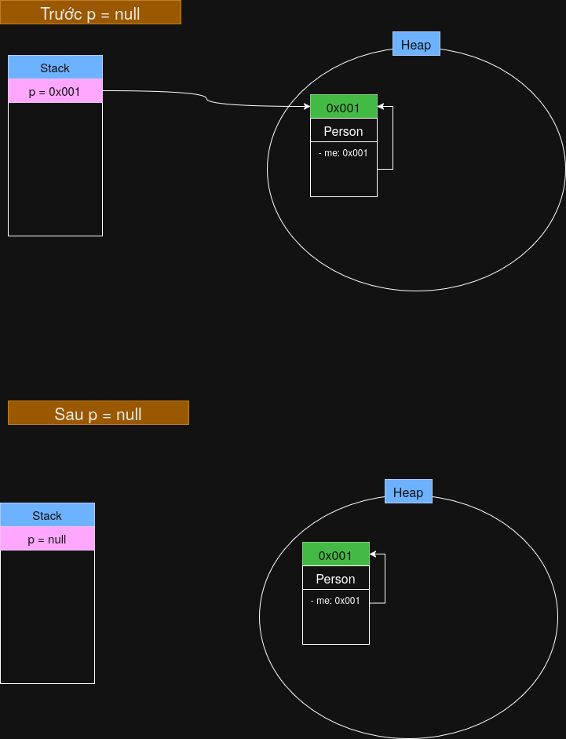

# Sau khi setMe(p) có bao nhiêu đối tượng Person tồn tại trong bộ nhớ?
- **1**
- Ta chỉ tạo duy nhất 1 đối tượng Person thông qua tham chiếu p. Phương thức setMe(p) chỉ trỏ thuộc tính me vào đối tượng Person được tạo qua p. Tóm lại là có 1 đối tượng Person nhưng có 2 tham chiếu tới đối tượng này.

# Sau dòng lệnh p = null; đối tượng Person có bị xóa ngay lập tức khỏi bộ nhớ không? Giải thích cơ chế hoạt động của Garbage Collection trong trường hợp này.
- **Không**.
- Bởi vì bộ dọn rác của Java (GC) được kích hoạt dựa trên lịch trình riêng chứ không phải khi tham chiếu bị xóa.
- GC sẽ được kích hoạt khi máy ảo Java báo bộ nhớ bị đầy hoặc thuật toán báo tiến hành quét. 1 đối tượng đủ điều kiện bị xóa là khi nó không còn tham chiếu nào trỏ tới. 
+ Tuy nhiên, trong trường hợp đối tượng Person, kể cả sau khi tham chiếu p bị xóa (đặt thành null) thì vẫn còn thuộc tính me của đối tượng này trỏ tới chính nó, dẫn tới vòng lặp tham chiếu (The Circular Reference Problem).
+ Để giải quyết vấn đề này, Java sử dụng thuật toán Phân tích tính chạm tới (Reachability Analysis). Java sẽ kiểm tra xem đối tượng này có tham chiếu gốc (biến cục bộ,...) nào không? Hay dễ hiểu là program còn có thể gọi tới đối tượng này thông qua biến nào không? Nếu không, thì xóa đối tượng đó.
+ Trong trường hợp Person, thuật toán trên không thể tìm ra biến nào trong program còn có thể gọi đối tượng này nên Person sẽ bị xóa khi GC tiến hành dọn dẹp.

# Đối tượng Person có thể được truy cập lại không? Giải thích.
- **Không**.
- Như bên trên đã giải thích. Không còn biến nào trong program tham chiếu tới ô bộ nhớ của đối tượng Person. Địa chỉ ô nhớ cuối cùng tại biến p đã bị xóa thành null.

# Vẽ sơ đồ bộ nhớ (Stack và Heap) tại 2 thời điểm: trước và sau khi p = null.
