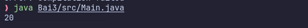
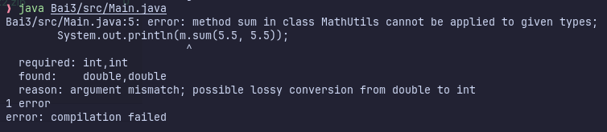

# Kết quả dòng (A)

- Khi biên dịch, Java kiểm tra kiểu của biến m (MathUtils) có hàm sum(int a, int b) hay không? -> Có.
- Khi chạy chương trình, Java tìm tới đối tượng thực sự mà biến m đang tham chiếu tới?
-> AdvancedMath. 
- Hàm sum đã bị override ở AdvancedMath là a + b + 10 nên kết quả trả về là 20.

# Kết quả dòng (B)

- Khi biên dịch, Java kiểm tra kiểu của biến m (MathUtils) có hàm sum(double a, double b) hay không?
-> Không có.
-> Lỗi biên dịch.