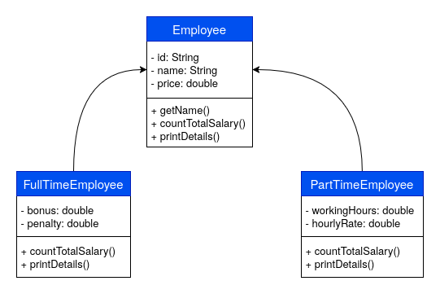

# Sơ đồ

- **Lớp trừu tượng Employee** chứa:
    + Các thuộc tính: id, name, birthday (String)
    + Các phương thức mẫu: countTotalSalary() và getDetails()

- **2 lớp con của Employee**: FullTimeEmployee và PartTimeEmployee.

- **FullTimeEmployee** chứa:
    + Các thuộc tính của Employee.
    + Các thuộc tính bổ sung: bonus, penalty (double)
    + Khai báo các phương thức mẫu: countTotalSalary() và getDetails()

- **PartTimeEmployee** chứa:
    + Các thuộc tính của Employee.
    + Các thuộc tính bổ sung:  (double)
    + Khai báo các phương thức mẫu: countTotalSalary() và getDetails()