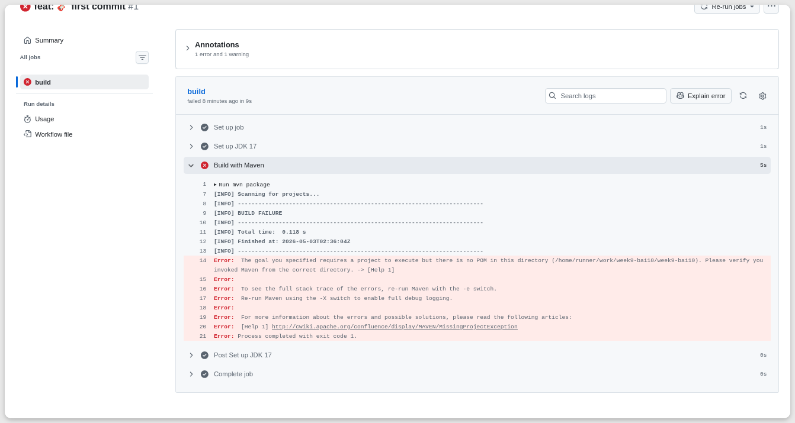
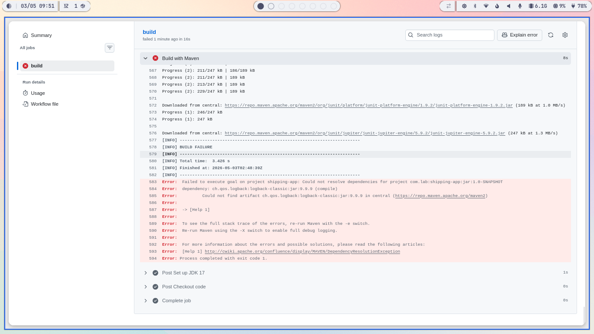
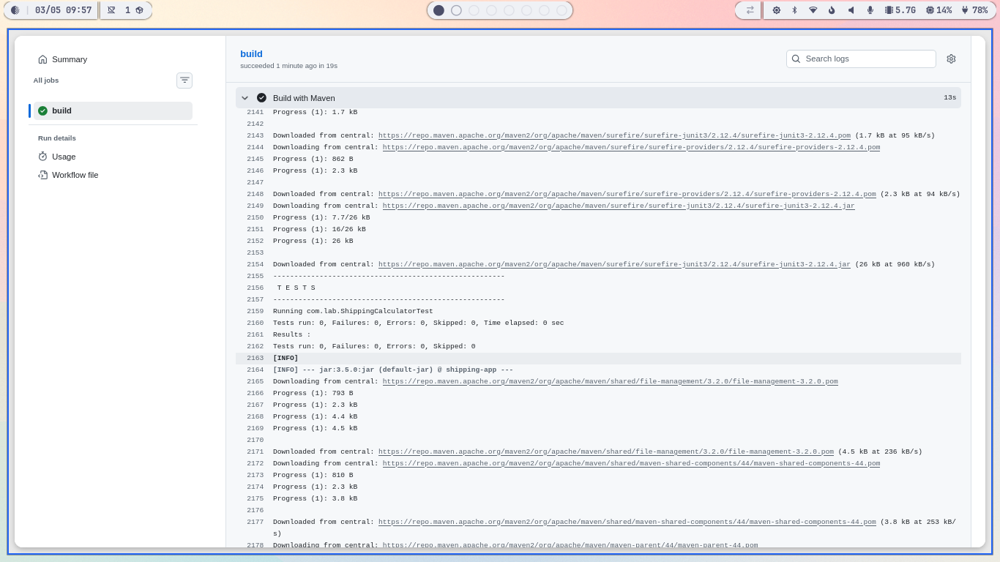
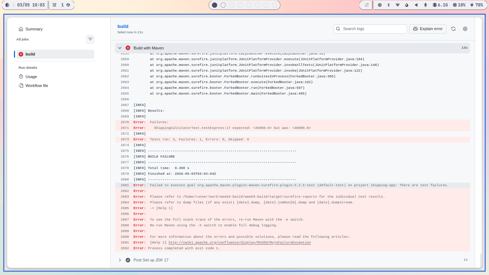

# Lỗi 1: Pipeline chạy nhưng không tìm thấy mã nguồn 
- File bị lỗi: `.github/workflows/ci.yaml` (dòng 9-10)
- Đoạn log: 
```
 Error:  The goal you specified requires a project to execute but there is no POM in this directory (/home/runner/work/week9-bai10/week9-bai10). Please verify you invoked Maven from the correct directory. -> [Help 1]
```


- Giải thích kỹ thuật: Môi trường chạy của Github Actions là hoàn toàn trống rỗng. Pipeline cài đặt JDK 17 và chạy lệnh `mvn package` mà chưa kéo (checkout) mã nguồn từ repository về môi trường. Do đó, Maven không tìm thấy file pom.xml nào để chạy.

- Cách sửa: Thêm action `actions/checkout` vào trước bước cài đặt Java.

# Lỗi 2: Dependency không tồn tại
- File bị lỗi: `.github/workflows/ci.yaml` (dòng 15-19)
- Đoạn log: 
```
Error:  Failed to execute goal on project shipping-app: Could not resolve dependencies for project com.lab:shipping-app:jar:1.0-SNAPSHOT
Error:  dependency: ch.qos.logback:logback-classic:jar:9.9.9 (compile)
Error:  	Could not find artifact ch.qos.logback:logback-classic:jar:9.9.9 in central (https://repo.maven.apache.org/maven2)
Error:  
```


- Giải thích kỹ thuật: File POM đang khai báo sử dụng thư viện logback-classic phiên bản 9.9.9. Đây là một phiên bản "ảo" (không hề tồn tại trên Maven Central Repository). Maven không thể tải được thư viện này nên quá trình build bị thất bại.
- Cách sửa: Sửa phiên bản Logback về một phiên bản thực tế (ví dụ: 1.4.14).

# Lỗi 3: Pha test bị fail, không có test nào được chạy
- File bị lỗi: pom.xml (dòng 29-33)
- Đoạn log:
```
[INFO] Tests run: 0, Failures: 0, Errors: 0, Skipped: 0
```

- Giải thích kỹ thuật: Plugin maven-surefire-plugin (chịu trách nhiệm chạy unit test trong vòng đời của Maven) đang được set ở phiên bản 2.12.4. Đây là phiên bản rất cũ, không hỗ trợ JUnit 5 (Jupiter). Để chạy được JUnit 5, Surefire plugin phải từ phiên bản 2.22.0 trở lên.

- Cách sửa: Cập nhật phiên bản của maven-surefire-plugin.

# Lỗi 4: Logic nghiệp vụ, làm test bị sai
- Gây lỗi tại:
Giả sử gõ nhầm giá dịch vụ từ 5000 thành 4000.
File: `src/main/java/com/lab/ShippingCalculator.java`
```
if (type.equals("EXPRESS")) return weight * 4000 + 20000;
```
- Đoạn log:
```
Error:  Failures: 
Error:    ShippingCalculatorTest.testExpress:17 expected: <45000.0> but was: <40000.0>
[INFO] 
Error:  Tests run: 3, Failures: 1, Errors: 0, Skipped: 0
```

- Giải thích kỹ thuật: CI workflows phát hiện có test bị sai. Do công thức bị sai dẫn đến kết quả bị sai lệch. Lệnh assertEquals của JUnit thất bại, kéo theo Maven Surefire fail toàn bộ quá trình build để ngăn code lỗi được deploy.
- Cách sửa: Mở lại file ShippingCalculator.java và hoàn nguyên thuật toán về lại như cũ.